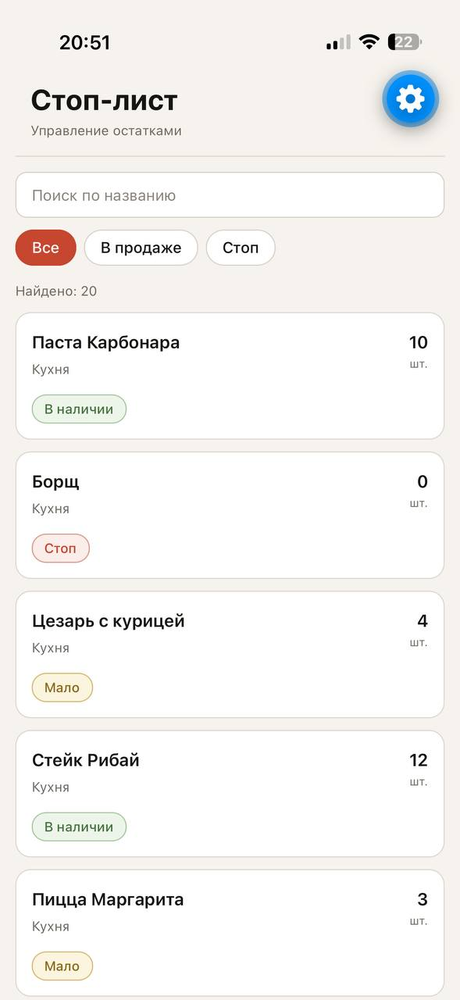
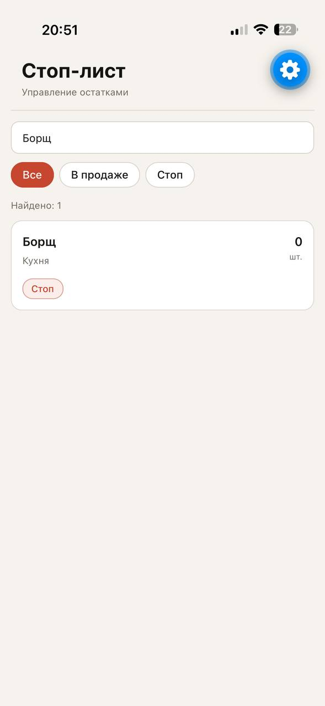
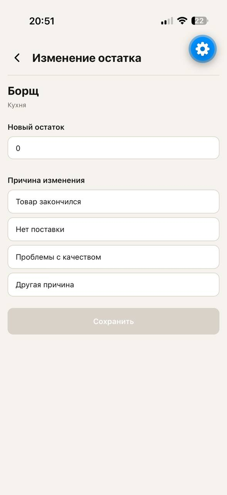
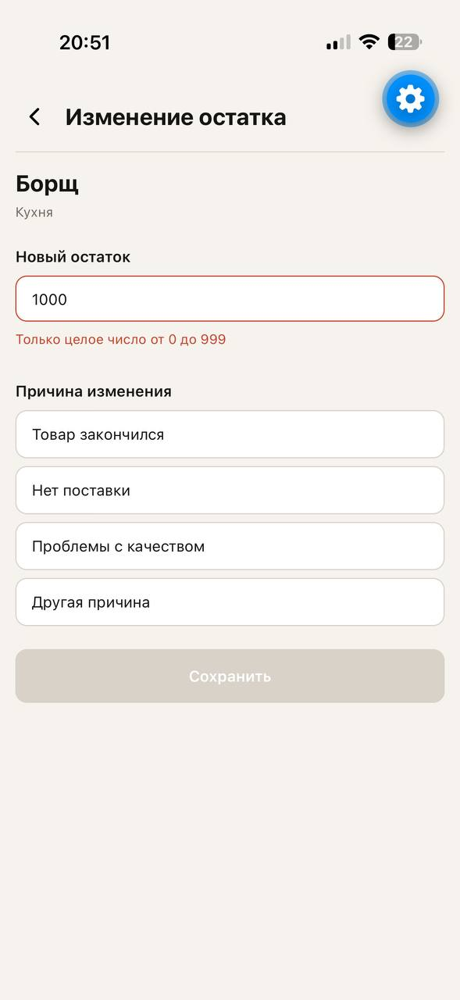

# Stop-list

Тестовое задание на позицию Junior React Native Developer.

Мобильное приложение для управления стоп-листом товаров в заведении.

## Стек

- React Native
- Expo SDK 57
- TypeScript
- React Navigation
- Zustand
- NativeWind
- React Native Reanimated
- ESLint

## Функциональность

### Стоп-лист

- Отображение списка из 20 товаров
- Категории товаров
- Отображение текущего остатка
- Автоматическое определение статуса:
  - `0` — стоп
  - `1–5` — мало
  - `>5` — в наличии
- Поиск по названию товара
- Поиск без учёта регистра
- Debounce поиска — 300 мс
- Фильтрация:
  - Все
  - В продаже
  - Стоп
- Отображение количества найденных товаров
- Состояния загрузки, ошибки и пустого результата
- Повторная загрузка после ошибки
- Плавное появление карточек при загрузке списка
- Анимация нажатия на карточку

### Изменение остатка

- Отдельный экран редактирования товара
- Типизированная навигация между экранами
- Ввод нового остатка от `0` до `999`
- Валидация целого числа
- Выбор причины изменения:
  - Товар закончился
  - Нет поставки
  - Проблемы с качеством
  - Другая причина
- Кнопка сохранения недоступна при невалидных данных
- Inline-отображение ошибок
- Сохранение введённых данных при ошибке API
- После успешного сохранения список обновляется автоматически

## Архитектура

Проект разделён на несколько основных частей:

```text
src/
├── api/          # Работа с mock API
├── components/   # Переиспользуемые UI-компоненты
├── hooks/        # Переиспользуемые React hooks
├── lib/          # Бизнес-логика, фильтрация и валидация
├── navigation/   # React Navigation
├── screens/      # Экраны приложения
├── store/        # Состояние приложения и формы
└── types/        # TypeScript типы
```

Состояние списка и операции с товарами управляются через Zustand.
Бизнес-логика фильтрации, определения статуса и валидации вынесена из UI-компонентов.

## Mock API

Для имитации API используется локальный mock API.

Запросы имеют искусственную задержку и случайно могут завершаться ошибкой. Это позволяет проверить состояния загрузки, ошибки и повторной загрузки.

## Запуск

Установить зависимости:

```bash
npm install
```

Запустить приложение:

```bash
npx expo start
```

После запуска приложение можно открыть через Expo Go или Android Emulator.
Используется Expo SDK 57.

## Проверка

Проверка TypeScript:

```bash
npx tsc --noEmit
```

Проверка ESLint:

```bash
npx expo lint
```

## Тестирование

Проект проверялся на Android Emulator и на Iphone.

Основные сценарии:

- загрузка списка товаров;
- поиск и debounce;
- фильтрация по статусу;
- переход к редактированию;
- валидация остатка;
- выбор причины изменения;
- успешное сохранение;
- обработка ошибки API.

## Принятые решения

- Для управления состоянием использован Zustand, так как состояние списка и формы необходимо сохранять независимо от UI-компонентов, при этом для такого небольшого приложения Redux был бы избыточен.
- Для навигации использован React Navigation с типизированными параметрами экранов, чтобы безопасно передавать `itemId` между экранами.
- Бизнес-логика фильтрации, определения статуса товара и валидации остатка вынесена в отдельные функции, чтобы не смешивать её с отображением.
- Для имитации реального API создан локальный mock API с задержкой и случайными ошибками, что позволяет проверить loading и error-состояния.
- Для UI используется NativeWind, чтобы сохранить единый стиль компонентов и не дублировать большое количество StyleSheet-описаний.
- Для анимаций выбран React Native Reanimated, чтобы реализовать плавное появление карточек и обратную связь при нажатии без использования стандартного Animated API.

## Если бы было больше времени

- Ещё немного доработал бы визуальную часть интерфейса и состояния элементов.
- Добавил бы дополнительные плавные анимации для переходов между состояниями и экранами.

## Скриншоты

### Стоп-лист



### Поиск



### Редактирование остатка



### Валидация


